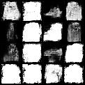
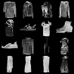
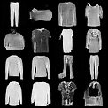

# Denoising Diffusion Probabilistic Models (DDPM) on Fashion-MNIST

[](https://www.python.org/)
[](https://pytorch.org/)
[](https://opensource.org/licenses/MIT)

A from-scratch implementation of a Denoising Diffusion Probabilistic Model (DDPM) in PyTorch for generative image modeling on the Fashion-MNIST dataset.

This project implements the complete diffusion training and sampling pipeline, including a custom U-Net backbone, sinusoidal timestep conditioning, configurable noise schedules, and iterative denoising for image generation.

---

## Overview

Diffusion models have emerged as one of the most effective approaches for generative modeling. Rather than generating images directly, DDPMs learn to reverse a gradual noise corruption process.

This repository demonstrates:

1. Forward diffusion through progressive noise injection
2. Reverse diffusion through learned denoising
3. Time-conditioned U-Net architecture
4. Training and sampling workflows
5. Visual monitoring of generation quality throughout training

The implementation is designed for clarity, reproducibility, and educational exploration of modern diffusion architectures.

---

## Project Highlights

* Built a DDPM training pipeline entirely from scratch in PyTorch
* Implemented a custom U-Net with timestep conditioning
* Developed a configurable forward and reverse diffusion scheduler
* Integrated hardware acceleration for Apple Silicon, CUDA, and CPU environments
* Generated and tracked sample quality across training epochs
* Applied diffusion modeling techniques used in modern image generation systems

---

## Model Architecture

### U-Net Backbone

The denoising network follows a U-Net architecture consisting of:

* Encoder downsampling path
* Bottleneck feature extraction layer
* Decoder upsampling path
* Skip connections for feature preservation

The model predicts the noise component added to an image at a given diffusion timestep.

### Timestep Conditioning

A sinusoidal embedding module transforms diffusion timesteps into high-dimensional representations.

This allows a single network to learn denoising behavior across all diffusion steps:

```text
t ∈ [0, T]
```

Each convolutional block receives timestep information through learned projections that are injected into intermediate feature maps.

### Group Normalization

Group Normalization is used instead of Batch Normalization to improve training stability.

Benefits include:

* Reduced sensitivity to batch size
* More stable optimization
* Improved diffusion training behavior

### Conditional Feature Injection

Time embeddings are projected into channel dimensions and added to feature maps throughout the network:

```python
h = h + time_embedding
```

This enables timestep-aware denoising at every stage of the architecture.

### Decoder Rescaling

Dynamic padding and resizing logic is incorporated into decoder blocks to avoid spatial dimension mismatches during upsampling.

---

## Repository Structure

| File           | Description                                                     |
| -------------- | --------------------------------------------------------------- |
| `ddpm.py`      | DDPM scheduler implementation for forward and reverse diffusion |
| `unet.py`      | U-Net architecture with sinusoidal timestep embeddings          |
| `train.py`     | Training pipeline including optimization and checkpointing      |
| `sample.py`    | Standalone image generation script                              |
| `checkpoints/` | Saved model checkpoints                                         |
| `samples/`     | Generated sample grids during training                          |

---

## Installation

### Clone the Repository

```bash
git clone https://github.com/AdityaInamdar334/Fine-Tuning-pre-trained-diffusion-model
cd diffusion-fashion-mnist
```

### Create a Virtual Environment

```bash
python3 -m venv venv
source venv/bin/activate
```

### Install Dependencies

```bash
pip install torch torchvision tqdm matplotlib
```

---

## Training

Train the diffusion model using:

```bash
python train.py
```

### Training Configuration

| Parameter       | Value         |
| --------------- | ------------- |
| Dataset         | Fashion-MNIST |
| Default Epochs  | 10            |
| Diffusion Steps | 1000          |
| Framework       | PyTorch       |

### Outputs

Checkpoints:

```text
checkpoints/
├── ddpm_epoch_1.pth
├── ddpm_epoch_2.pth
└── ...
```

Generated samples:

```text
samples/
├── epoch_1.png
├── epoch_2.png
└── ...
```

---

## Sampling

Generate images using a trained checkpoint:

```bash
python sample.py \
  --checkpoint checkpoints/ddpm_epoch_10.pth \
  --num_samples 16 \
  --output generated_samples.png
```

### Available Arguments

| Argument          | Description                      |
| ----------------- | -------------------------------- |
| `--checkpoint`    | Path to trained model checkpoint |
| `--num_samples`   | Number of generated images       |
| `--num_timesteps` | Reverse diffusion steps          |
| `--output`        | Output image filename            |

---

## Training Results

The quality of generated samples improves progressively as the model learns the reverse diffusion process.

| Early Training                            | Mid Training                     | Final Training                          |
| ----------------------------------------- | -------------------------------- | --------------------------------------- |
| Initial noise patterns and rough outlines | Recognizable clothing structures | Clear Fashion-MNIST category generation |

Add generated sample grids below:

```markdown



```

---

## Technical Components

### Diffusion Scheduler

The scheduler implements:

* Linear beta scheduling
* Forward noise addition
* Reverse denoising updates
* Variance computation
* Sampling trajectory generation

### Loss Function

Training minimizes the mean squared error between:

* True injected noise
* Predicted noise from the U-Net

```math
L = ||\epsilon - \epsilon_\theta(x_t, t)||^2
```

### Hardware Support

Automatic device detection:

```python
mps    # Apple Silicon
cuda   # NVIDIA GPU
cpu    # CPU fallback
```

---

## Future Improvements

Potential extensions include:

* DDIM sampling
* Class-conditioned diffusion
* CIFAR-10 and CelebA support
* Attention-enhanced U-Net blocks
* Exponential Moving Average (EMA)
* Classifier-free guidance
* Mixed precision training
* Latent diffusion architectures

---

## Technology Stack

* Python
* PyTorch
* Diffusion Models (DDPM)
* U-Net
* Fashion-MNIST
* Computer Vision
* Generative AI

---

## License

This project is released under the MIT License.

See the `LICENSE` file for additional information.

---

## References

* Denoising Diffusion Probabilistic Models (Ho et al., 2020)
* Improved Denoising Diffusion Probabilistic Models (Nichol & Dhariwal, 2021)
* PyTorch Deep Learning Framework
* Fashion-MNIST Dataset
